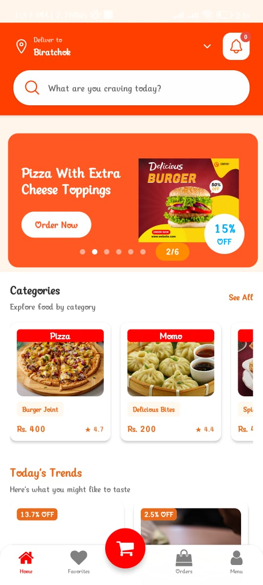
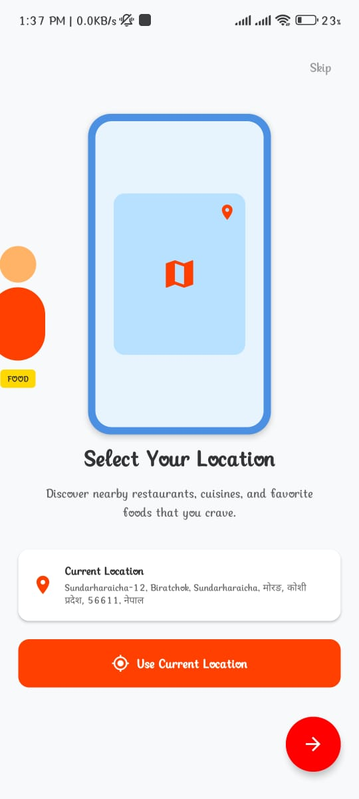
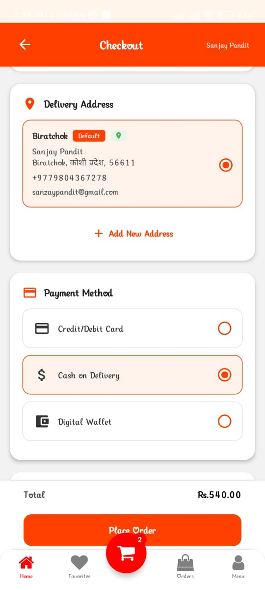
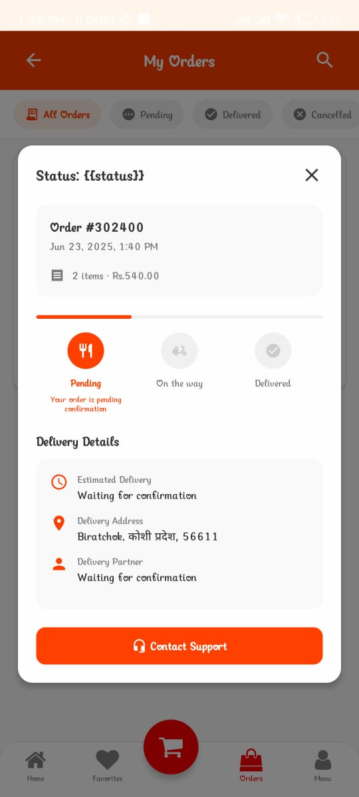

# 🍔 FoodFlash – Mobile Food Delivery App

FoodFlash is a mobile food delivery application developed using **React Native**. It allows users to browse restaurants, explore food items by categories, view product highlights, select preferred languages, and place orders based on their location. The app supports real-time geolocation and multi-language support to deliver a personalized experience.

## 📱 Features

- 🌍 Multilingual Support (English & Nepali)
- 📍 Geolocation-Based Restaurant Discovery
- 🍽️ Browse Foods by Category & Highlights
- 🔍 Search Specific Restaurants or Dishes
- ❤️ Mark Favorite Items for Quick Access
- 🛒 Add to Cart & Order Food
- 🔐 Firebase Authentication
- 🗺️ OpenStreetMap API Integration for Location Services

## 🛠️ Tech Stack

- **Frontend:** React Native, TypeScript
- **Backend Services:** Firebase (Auth, Database)
- **Maps & Location:** OpenStreetMap (Nominatim API)
- **State Management:** React Context API / useState
- **Navigation:** React Navigation
- **Internationalization:** i18next
- **Version Control:** Git & GitHub


> ## 📷 Screenshots

### 🏠 Home Screen


### 🍕 Product Details


### 🛒 Cart Screen


### ❤️ Favorites



## 🚀 Getting Started

### Prerequisites

- Node.js & npm
- React Native CLI
- Android Studio (for Android Emulator or device testing)
- Firebase Project Setup

### Installation

```bash
# Clone the repository
git clone https://github.com/Sanjaypandit1/Foodflash.git

# Navigate to the project directory
cd Foodflash

# Install dependencies
npm install

# Run the app on Android
npx react-native run-android
